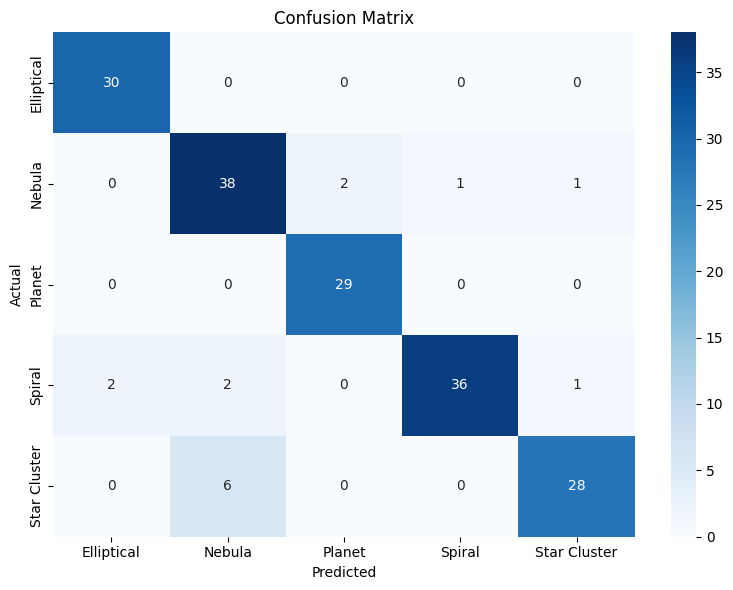

# Image Classification Project

## Model Evaluation & Performance Metrics

The final ResNet-50 framework was evaluated on an independent test set containing **176 distinct images**. The evaluation metrics below were generated using `scikit-learn` (`metrics.classification_report`), achieving an overall **Test Set Accuracy of 91.48%.**

### Classification Report Matrix

| Target Class | Precision | Recall | F1-Score | Sample Size (Support) |
| :--- | :---: | :---: | :---: | :---: |
| **Elliptical Galaxy** | `0.9375` | `1.0000` | **`0.9677`** | 30 |
| **Nebula** | `0.8261` | `0.9048` | `0.8636` | 42 |
| **Planet** | `0.9355` | `1.0000` | **`0.9667`** | 29 |
| **Spiral Galaxy** | `0.9730` | `0.8780` | `0.9231` | 41 |
| **Star Cluster** | `0.9333` | `0.8235` | `0.8750` | 34 |
| | | | | |
| **Overall Accuracy** | — | — | **`0.9148`** | **176** |
| **Macro Average** | `0.9211` | `0.9213` | `0.9212` | 176 |
| **Weighted Average** | `0.9180` | `0.9148` | `0.9144` | 176 |

---

## Confusion Matrix


---

To keep this repository lightweight and prevent storage bloat, the full 1,508-image training batch is hosted externally at https://drive.google.com/drive/folders/1ACld4iuCli1RlKnefHQkwO6yMEXILImO?usp=sharing

A curated sub-folder (`dataset-sample/`) containing a few diagnostic preview images per class is included directly in this repository for immediate model testing and inference verification.

## Dataset Sources Used
A total of 1,746 images were used to train and test the model. The dataset is evenly split across 5 categories.
* [NOIRLab Star Cluster Archive](https://noirlab.edu/public/images/archive/category/starclusters/page/2/?sort=-release_date)
* [Kaggle Nebula Dataset](https://www.kaggle.com/datasets/akhileshravi/nebula-images)
* [Kaggle Galaxy Zoo 2 (GZ2) Resized Dataset](https://www.kaggle.com/datasets/robertmifsud/resized-reduced-gz2-images)
* [Roboflow Planet Dataset](https://universe.roboflow.com/fashion-8zzww/planet-2vlvi/dataset/2)
* [ESA Hubble Space Telescope Archive](https://esahubble.org/)

---

## Model Architecture 

The core of this computer vision project uses a manually built **ResNet-50 (Residual Network)** architecture designed from scratch in PyTorch. The network is structured to prevent the vanishing gradient problem, allowing it to learn deep and complex patterns safely.

### Core Architecture Highlights

* **ResNet-50 Bottleneck Structure:** Instead of standard layers, this network uses a 3-layer bottleneck design inside each residual block. It uses a $1\times1$ convolution to shrink channels, a $3\times3$ convolution to look at features, and another $1\times1$ convolution to restore the dimensions. This makes the model incredibly deep while keeping it computationally efficient.
* **Dimensional Alignment of Tensors:** As data flows deeper into the network, the image grid size shrinks and the channel depth expands. Because you cannot add two matrices of different sizes together, a custom $1\times1$ 2D Convolutional shortcut path (`identity_downsample`) was built. This automatically resizes the shortcut path tensor so it perfectly matches the main path for matrix addition.
* **Final Output Stage:** At the very end of the network, an Adaptive Average Pooling layer flattens the features down to a 2048-dimensional vector. From there, a single linear layer is used (`nn.Linear(2048, 5)`) to map those final features directly to our 5 target classes.

---
## Setup

1. Clone this project repository and satisfy the local environment library stack requirements:
   ```bash
   pip install -r requirements.txt
